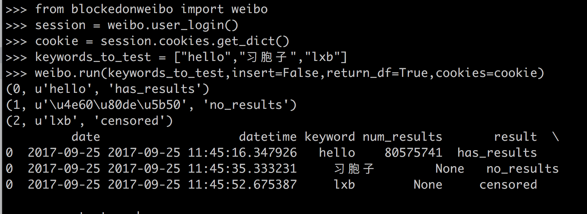

# What is blockedonweibo?

This python package allows you to automate tests to check if a keyword is censored or not on Sina Weibo, a Chinese social media site. It is an updated version of the script which was used to detect keywords on the site, http://blockedonweibo.com. It handles interrupted tests, multiple tests per day, storing results to a database, and a number of other features which simplify testing Weibo censorship at scale. The researcher merely has to feed the script a list of words for one-off tests. For recurring tests, simply wrap the script with a scheduler.



# IMPORTANT: Upgrading from v0.1 with an existing database? 
The database table has been modified to accomodate tracking of minimum keyword strings triggering 
censorship. If you used blockedonweibo v0.1 and you used a database to store results, you will 
need to update your database file. 

**To migrate your older database file**
1. Move `update_db.py` to the same file directory as your database file ("results.sqlite" if you followed
this setup guide)
2. In terminal, run `python update_db.py` and confirm database file. 

### Version 0.2 changes 
* now includes a feature to find canonical censored keywords (minimum set of keywords required to trigger explicit censorship message)
    * to run, pass `get_canonical=True` with rest of variables into `run()`
    * see section 4.8


# Table of Contents
 <p><div class="lev1 toc-item"><a href="#What-is-blockedonweibo?" data-toc-modified-id="What-is-blockedonweibo?-1"><span class="toc-item-num">1&nbsp;&nbsp;</span>What is blockedonweibo?</a></div><div class="lev1 toc-item"><a href="#Install-the-blockedonweibo-package" data-toc-modified-id="Install-the-blockedonweibo-package-2"><span class="toc-item-num">2&nbsp;&nbsp;</span>Install the blockedonweibo package</a></div><div class="lev1 toc-item"><a href="#Adjust-your-settings" data-toc-modified-id="Adjust-your-settings-3"><span class="toc-item-num">3&nbsp;&nbsp;</span>Adjust your settings</a></div><div class="lev1 toc-item"><a href="#Let's-start-testing!" data-toc-modified-id="Let's-start-testing!-4"><span class="toc-item-num">4&nbsp;&nbsp;</span>Let's start testing!</a></div><div class="lev2 toc-item"><a href="#Pass-a-dictionary-of-keywords-to-start-testing" data-toc-modified-id="Pass-a-dictionary-of-keywords-to-start-testing-41"><span class="toc-item-num">4.1&nbsp;&nbsp;</span>Pass a dictionary of keywords to start testing</a></div><div class="lev2 toc-item"><a href="#Pass-in-cookies-so-you-can-also-get-the-number-of-results.-Pass-in-sqlite_file-to-save-the-results-to-disk-so-you-can-load-it-later" data-toc-modified-id="Pass-in-cookies-so-you-can-also-get-the-number-of-results.-Pass-in-sqlite_file-to-save-the-results-to-disk-so-you-can-load-it-later-42"><span class="toc-item-num">4.2&nbsp;&nbsp;</span>Pass in cookies so you can also get the number of results. Pass in sqlite_file to save the results to disk so you can load it later</a></div><div class="lev2 toc-item"><a href="#If-your-test-gets-interrupted-or-you-add-more-keywords,-you-can-pick-up-where-you-left-off" data-toc-modified-id="If-your-test-gets-interrupted-or-you-add-more-keywords,-you-can-pick-up-where-you-left-off-43"><span class="toc-item-num">4.3&nbsp;&nbsp;</span>If your test gets interrupted or you add more keywords, you can pick up where you left off</a></div><div class="lev2 toc-item"><a href="#You-can-attach-notes-or-categorizations-to-your-keywords-for-easy-querying-and-analysis-later" data-toc-modified-id="You-can-attach-notes-or-categorizations-to-your-keywords-for-easy-querying-and-analysis-later-44"><span class="toc-item-num">4.4&nbsp;&nbsp;</span>You can attach notes or categorizations to your keywords for easy querying and analysis later</a></div><div class="lev2 toc-item"><a href="#If-you-want-to-test-multiple-times-a-day,-just-pass-in-the-test_number-param" data-toc-modified-id="If-you-want-to-test-multiple-times-a-day,-just-pass-in-the-test_number-param-45"><span class="toc-item-num">4.5&nbsp;&nbsp;</span>If you want to test multiple times a day, just pass in the <code>test_number</code> param</a></div><div class="lev2 toc-item"><a href="#It-can-skip-redundant-keywords" data-toc-modified-id="It-can-skip-redundant-keywords-46"><span class="toc-item-num">4.6&nbsp;&nbsp;</span>It can skip redundant keywords</a></div><div class="lev2 toc-item"><a href="#You-can-also-pass-in-lists-if-you-prefer-(though-you-can't-include-the-source-or-notes)" data-toc-modified-id="You-can-also-pass-in-lists-if-you-prefer-(though-you-can't-include-the-source-or-notes)-47"><span class="toc-item-num">4.7&nbsp;&nbsp;</span>You can also pass in lists if you prefer (though you can't include the source or notes)</a></div><div class="lev2 toc-item"><a href="#It-can-detect-the-canonical-(minimum)-set-of-characters-in-the-search-query-triggering-censorship" data-toc-modified-id="It-can-detect-the-canonical-(minimum)-set-of-characters-in-the-search-query-triggering-censorship-48"><span class="toc-item-num">4.8&nbsp;&nbsp;</span>It can detect the canonical (minimum) set of characters in the search query triggering censorship</a></div>

# Install the blockedonweibo package

The github repo for this Weibo keyword testing script is located at https://github.com/jasonqng/blocked-on-weibo.

To begin using this python package, inside your terminal, do a
```
git clone https://github.com/jasonqng/blocked-on-weibo.git
```
or 

```
git clone git@github.com:jasonqng/blocked-on-weibo.git
``` 
(if you prefer ssh).

Then `cd` into the downloaded directory and install the requirements then the package:

```
pip install -r requirements.txt
python setup.py install
```

To confirm the installation works, in a python shell (you can start by running `python` from terminal), try importing the package:

```
import blockedonweibo
```

If you don't get any errors, things have installed successfully. If not, you may need to fiddle with your python paths and settings to ensure it's being installed to the correct location.

# Adjust your settings

Your python script only requires the following. All other imports are handled by the package.


```python
from blockedonweibo import weibo
import pandas as pd
```

You have the option of saving your test results to a file. You'll need to pass a path to to a file which will store the results in sqlite format. It can be helpful to set this at the top of your script and pass the variable each time you run the test.


```python
sqlite_file = 'results.sqlite' # name of sqlite file to read from/write to
```

If you want to erase any existing data you have in the sqlite file defined above, just pass overwrite=True to the `create_database` function. Otherwise any new results will be appended to the end of the database.


```python
weibo.create_database(sqlite_file, overwrite=True)
```

This testing script is enhanced if you allow it to log into Weibo, which increases your rate limit threshold as well as returns the number of results a search says it has. This script will work without your supplying credentials, but it is highly recommended. To do so, edit the `weibo_credentials.py` with your email address and password. The file is ignored and will not be uploaded by default when you push commits to github. You can inspect the code to verify that the credentials don't go anywhere except to weibo.

Using those credentials, the script logs you in and fetches a cookie for the user session you create. This cookie can be saved to a file by passing the `write_cookie` parameter in the `user_login` function.


```python
session = weibo.user_login(write_cookie=True)
```

There is a helper function to verify that the cookie actually works


```python
cookie = session.cookies.get_dict()
print(weibo.verify_cookies_work(cookie))
```

    True


If you have the cookie already written to disk, you don't need to perform another `user_login` and instead, you can just use the `load_cookies` function to fetch the cookie from the file. Again, you can verify that it works. Just store the cookie's contents (a dictionary) to a variable and pass that to the `run` function below if you want to test as if you were logged in. Otherwise, it will emulate a search by a logged out user.


```python
cookie = weibo.load_cookies()
print(weibo.verify_cookies_work(cookie))
```

    True


# Let's start testing!

## Pass a dictionary of keywords to start testing


```python
sample_keywords_df = pd.DataFrame(
    [{'keyword':'hello','source':'my dataframe'},
     {'keyword':'lxb','source':'my dataframe'},
     {'keyword':u'习胞子','source':'my dataframe'}
    ])
```


```python
sample_keywords_df
```


<div>
<table border="1" class="dataframe">
  <thead>
    <tr style="text-align: right;">
      <th></th>
      <th>keyword</th>
      <th>source</th>
    </tr>
  </thead>
  <tbody>
    <tr>
      <th>0</th>
      <td>hello</td>
      <td>my dataframe</td>
    </tr>
    <tr>
      <th>1</th>
      <td>lxb</td>
      <td>my dataframe</td>
    </tr>
    <tr>
      <th>2</th>
      <td>习胞子</td>
      <td>my dataframe</td>
    </tr>
  </tbody>
</table>
</div>


```python
weibo.run(sample_keywords_df,insert=False,return_df=True)
```

    (0, u'hello', 'has_results')
    (1, u'lxb', 'censored')
    (2, u'\u4e60\u80de\u5b50', 'no_results')


<div>
<table border="1" class="dataframe">
  <thead>
    <tr style="text-align: right;">
      <th></th>
      <th>date</th>
      <th>datetime</th>
      <th>keyword</th>
      <th>num_results</th>
      <th>result</th>
      <th>source</th>
      <th>test_number</th>
    </tr>
  </thead>
  <tbody>
    <tr>
      <th>0</th>
      <td>2017-09-25</td>
      <td>2017-09-25 10:12:45.280812</td>
      <td>hello</td>
      <td>[]</td>
      <td>has_results</td>
      <td>my dataframe</td>
      <td>1</td>
    </tr>
    <tr>
      <th>0</th>
      <td>2017-09-25</td>
      <td>2017-09-25 10:13:00.191900</td>
      <td>lxb</td>
      <td>None</td>
      <td>censored</td>
      <td>my dataframe</td>
      <td>1</td>
    </tr>
    <tr>
      <th>0</th>
      <td>2017-09-25</td>
      <td>2017-09-25 10:13:16.356805</td>
      <td>习胞子</td>
      <td>None</td>
      <td>no_results</td>
      <td>my dataframe</td>
      <td>1</td>
    </tr>
  </tbody>
</table>
</div>


## Pass in cookies so you can also get the number of results. Pass in sqlite_file to save the results to disk so you can load it later


```python
weibo.run(sample_keywords_df,sqlite_file=sqlite_file,cookies=cookie)
```

    (0, u'hello', 'has_results')
    (1, u'lxb', 'censored')
    (2, u'\u4e60\u80de\u5b50', 'no_results')


```python
weibo.sqlite_to_df(sqlite_file)
```


<div>
<table border="1" class="dataframe">
  <thead>
    <tr style="text-align: right;">
      <th></th>
      <th>id</th>
      <th>date</th>
      <th>datetime_logged</th>
      <th>test_number</th>
      <th>keyword</th>
      <th>censored</th>
      <th>no_results</th>
      <th>reset</th>
      <th>is_canonical</th>
      <th>result</th>
      <th>source</th>
      <th>orig_keyword</th>
      <th>num_results</th>
      <th>notes</th>
    </tr>
  </thead>
  <tbody>
    <tr>
      <th>0</th>
      <td>0</td>
      <td>2017-09-25</td>
      <td>2017-09-25 10:13:37.816720</td>
      <td>1</td>
      <td>hello</td>
      <td>0</td>
      <td>0</td>
      <td>0</td>
      <td>0</td>
      <td>has_results</td>
      <td>my dataframe</td>
      <td>None</td>
      <td>80454701.0</td>
      <td>None</td>
    </tr>
    <tr>
      <th>1</th>
      <td>1</td>
      <td>2017-09-25</td>
      <td>2017-09-25 10:13:54.356722</td>
      <td>1</td>
      <td>lxb</td>
      <td>0</td>
      <td>0</td>
      <td>0</td>
      <td>0</td>
      <td>censored</td>
      <td>my dataframe</td>
      <td>None</td>
      <td>NaN</td>
      <td>None</td>
    </tr>
    <tr>
      <th>2</th>
      <td>2</td>
      <td>2017-09-25</td>
      <td>2017-09-25 10:14:11.489530</td>
      <td>1</td>
      <td>习胞子</td>
      <td>0</td>
      <td>0</td>
      <td>0</td>
      <td>0</td>
      <td>no_results</td>
      <td>my dataframe</td>
      <td>None</td>
      <td>NaN</td>
      <td>None</td>
    </tr>
  </tbody>
</table>
</div>


## If your test gets interrupted or you add more keywords, you can pick up where you left off

Let's pretend I wanted to test four total keywords, but I was only able to complete the first three above. I'll go ahead and add one more keyword to the test list to replicate an unfinished keyword.


```python
sample_keywords_df.loc[len(sample_keywords_df.index)] = ['刘晓波','my dataframe']
```


```python
sample_keywords_df
```


<div>
<table border="1" class="dataframe">
  <thead>
    <tr style="text-align: right;">
      <th></th>
      <th>keyword</th>
      <th>source</th>
    </tr>
  </thead>
  <tbody>
    <tr>
      <th>0</th>
      <td>hello</td>
      <td>my dataframe</td>
    </tr>
    <tr>
      <th>1</th>
      <td>lxb</td>
      <td>my dataframe</td>
    </tr>
    <tr>
      <th>2</th>
      <td>习胞子</td>
      <td>my dataframe</td>
    </tr>
    <tr>
      <th>3</th>
      <td>刘晓波</td>
      <td>my dataframe</td>
    </tr>
  </tbody>
</table>
</div>


```python
weibo.run(sample_keywords_df,sqlite_file=sqlite_file,cookies=cookie)
```

    (3, u'\u5218\u6653\u6ce2', 'censored')


Neat-o, it was smart enough to start right at that new keyword and not start all over again!


```python
weibo.sqlite_to_df(sqlite_file)
```


<div>
<table border="1" class="dataframe">
  <thead>
    <tr style="text-align: right;">
      <th></th>
      <th>id</th>
      <th>date</th>
      <th>datetime_logged</th>
      <th>test_number</th>
      <th>keyword</th>
      <th>censored</th>
      <th>no_results</th>
      <th>reset</th>
      <th>is_canonical</th>
      <th>result</th>
      <th>source</th>
      <th>orig_keyword</th>
      <th>num_results</th>
      <th>notes</th>
    </tr>
  </thead>
  <tbody>
    <tr>
      <th>0</th>
      <td>0</td>
      <td>2017-09-25</td>
      <td>2017-09-25 10:13:37.816720</td>
      <td>1</td>
      <td>hello</td>
      <td>0</td>
      <td>0</td>
      <td>0</td>
      <td>0</td>
      <td>has_results</td>
      <td>my dataframe</td>
      <td>None</td>
      <td>80454701.0</td>
      <td>None</td>
    </tr>
    <tr>
      <th>1</th>
      <td>1</td>
      <td>2017-09-25</td>
      <td>2017-09-25 10:13:54.356722</td>
      <td>1</td>
      <td>lxb</td>
      <td>0</td>
      <td>0</td>
      <td>0</td>
      <td>0</td>
      <td>censored</td>
      <td>my dataframe</td>
      <td>None</td>
      <td>NaN</td>
      <td>None</td>
    </tr>
    <tr>
      <th>2</th>
      <td>2</td>
      <td>2017-09-25</td>
      <td>2017-09-25 10:14:11.489530</td>
      <td>1</td>
      <td>习胞子</td>
      <td>0</td>
      <td>0</td>
      <td>0</td>
      <td>0</td>
      <td>no_results</td>
      <td>my dataframe</td>
      <td>None</td>
      <td>NaN</td>
      <td>None</td>
    </tr>
    <tr>
      <th>3</th>
      <td>3</td>
      <td>2017-09-25</td>
      <td>2017-09-25 10:14:29.667395</td>
      <td>1</td>
      <td>刘晓波</td>
      <td>0</td>
      <td>0</td>
      <td>0</td>
      <td>0</td>
      <td>censored</td>
      <td>my dataframe</td>
      <td>None</td>
      <td>NaN</td>
      <td>None</td>
    </tr>
  </tbody>
</table>
</div>


## You can attach notes or categorizations to your keywords for easy querying and analysis later


```python
new_keywords_df = pd.DataFrame(
    [{'keyword':'pokemon','source':'my dataframe',"notes":"pop culture"},
     {'keyword':'jay chou','source':'my dataframe',"notes":"pop culture"},
     {'keyword':u'weibo','source':'my dataframe',"notes":"social media"}
    ])
merged_keywords_df = pd.concat([sample_keywords_df,new_keywords_df]).reset_index(drop=True)
merged_keywords_df
```


<div>
<table border="1" class="dataframe">
  <thead>
    <tr style="text-align: right;">
      <th></th>
      <th>keyword</th>
      <th>notes</th>
      <th>source</th>
    </tr>
  </thead>
  <tbody>
    <tr>
      <th>0</th>
      <td>hello</td>
      <td>NaN</td>
      <td>my dataframe</td>
    </tr>
    <tr>
      <th>1</th>
      <td>lxb</td>
      <td>NaN</td>
      <td>my dataframe</td>
    </tr>
    <tr>
      <th>2</th>
      <td>习胞子</td>
      <td>NaN</td>
      <td>my dataframe</td>
    </tr>
    <tr>
      <th>3</th>
      <td>刘晓波</td>
      <td>NaN</td>
      <td>my dataframe</td>
    </tr>
    <tr>
      <th>4</th>
      <td>pokemon</td>
      <td>pop culture</td>
      <td>my dataframe</td>
    </tr>
    <tr>
      <th>5</th>
      <td>jay chou</td>
      <td>pop culture</td>
      <td>my dataframe</td>
    </tr>
    <tr>
      <th>6</th>
      <td>weibo</td>
      <td>social media</td>
      <td>my dataframe</td>
    </tr>
  </tbody>
</table>
</div>


```python
weibo.run(merged_keywords_df,sqlite_file=sqlite_file,cookies=cookie)
```

    (4, u'pokemon', 'has_results')
    (5, u'jay chou', 'has_results')
    (6, u'weibo', 'has_results')


```python
weibo.sqlite_to_df(sqlite_file)
```


<div>
<table border="1" class="dataframe">
  <thead>
    <tr style="text-align: right;">
      <th></th>
      <th>id</th>
      <th>date</th>
      <th>datetime_logged</th>
      <th>test_number</th>
      <th>keyword</th>
      <th>censored</th>
      <th>no_results</th>
      <th>reset</th>
      <th>is_canonical</th>
      <th>result</th>
      <th>source</th>
      <th>orig_keyword</th>
      <th>num_results</th>
      <th>notes</th>
    </tr>
  </thead>
  <tbody>
    <tr>
      <th>0</th>
      <td>0</td>
      <td>2017-09-25</td>
      <td>2017-09-25 10:13:37.816720</td>
      <td>1</td>
      <td>hello</td>
      <td>0</td>
      <td>0</td>
      <td>0</td>
      <td>0</td>
      <td>has_results</td>
      <td>my dataframe</td>
      <td>None</td>
      <td>80454701.0</td>
      <td>None</td>
    </tr>
    <tr>
      <th>1</th>
      <td>1</td>
      <td>2017-09-25</td>
      <td>2017-09-25 10:13:54.356722</td>
      <td>1</td>
      <td>lxb</td>
      <td>0</td>
      <td>0</td>
      <td>0</td>
      <td>0</td>
      <td>censored</td>
      <td>my dataframe</td>
      <td>None</td>
      <td>NaN</td>
      <td>None</td>
    </tr>
    <tr>
      <th>2</th>
      <td>2</td>
      <td>2017-09-25</td>
      <td>2017-09-25 10:14:11.489530</td>
      <td>1</td>
      <td>习胞子</td>
      <td>0</td>
      <td>0</td>
      <td>0</td>
      <td>0</td>
      <td>no_results</td>
      <td>my dataframe</td>
      <td>None</td>
      <td>NaN</td>
      <td>None</td>
    </tr>
    <tr>
      <th>3</th>
      <td>3</td>
      <td>2017-09-25</td>
      <td>2017-09-25 10:14:29.667395</td>
      <td>1</td>
      <td>刘晓波</td>
      <td>0</td>
      <td>0</td>
      <td>0</td>
      <td>0</td>
      <td>censored</td>
      <td>my dataframe</td>
      <td>None</td>
      <td>NaN</td>
      <td>None</td>
    </tr>
    <tr>
      <th>4</th>
      <td>4</td>
      <td>2017-09-25</td>
      <td>2017-09-25 10:14:49.107078</td>
      <td>1</td>
      <td>pokemon</td>
      <td>0</td>
      <td>0</td>
      <td>0</td>
      <td>0</td>
      <td>has_results</td>
      <td>my dataframe</td>
      <td>None</td>
      <td>5705260.0</td>
      <td>pop culture</td>
    </tr>
    <tr>
      <th>5</th>
      <td>5</td>
      <td>2017-09-25</td>
      <td>2017-09-25 10:15:09.762484</td>
      <td>1</td>
      <td>jay chou</td>
      <td>0</td>
      <td>0</td>
      <td>0</td>
      <td>0</td>
      <td>has_results</td>
      <td>my dataframe</td>
      <td>None</td>
      <td>881.0</td>
      <td>pop culture</td>
    </tr>
    <tr>
      <th>6</th>
      <td>6</td>
      <td>2017-09-25</td>
      <td>2017-09-25 10:15:28.100418</td>
      <td>1</td>
      <td>weibo</td>
      <td>0</td>
      <td>0</td>
      <td>0</td>
      <td>0</td>
      <td>has_results</td>
      <td>my dataframe</td>
      <td>None</td>
      <td>63401495.0</td>
      <td>social media</td>
    </tr>
  </tbody>
</table>
</div>


```python
results = weibo.sqlite_to_df(sqlite_file)
results.query("notes=='pop culture'")
```


<div>
<table border="1" class="dataframe">
  <thead>
    <tr style="text-align: right;">
      <th></th>
      <th>id</th>
      <th>date</th>
      <th>datetime_logged</th>
      <th>test_number</th>
      <th>keyword</th>
      <th>censored</th>
      <th>no_results</th>
      <th>reset</th>
      <th>is_canonical</th>
      <th>result</th>
      <th>source</th>
      <th>orig_keyword</th>
      <th>num_results</th>
      <th>notes</th>
    </tr>
  </thead>
  <tbody>
    <tr>
      <th>4</th>
      <td>4</td>
      <td>2017-09-25</td>
      <td>2017-09-25 10:14:49.107078</td>
      <td>1</td>
      <td>pokemon</td>
      <td>0</td>
      <td>0</td>
      <td>0</td>
      <td>0</td>
      <td>has_results</td>
      <td>my dataframe</td>
      <td>None</td>
      <td>5705260.0</td>
      <td>pop culture</td>
    </tr>
    <tr>
      <th>5</th>
      <td>5</td>
      <td>2017-09-25</td>
      <td>2017-09-25 10:15:09.762484</td>
      <td>1</td>
      <td>jay chou</td>
      <td>0</td>
      <td>0</td>
      <td>0</td>
      <td>0</td>
      <td>has_results</td>
      <td>my dataframe</td>
      <td>None</td>
      <td>881.0</td>
      <td>pop culture</td>
    </tr>
  </tbody>
</table>
</div>


```python
results.query("notes=='pop culture'").num_results.mean()
```


    2853070.5


## If you want to test multiple times a day, just pass in the `test_number` param

You can off `verbose` output in case you don't need to troubleshoot anything...


```python
weibo.run(sample_keywords_df,sqlite_file=sqlite_file,cookies=cookie,verbose='none',test_number=2)
```


```python
weibo.sqlite_to_df(sqlite_file)
```


<div>
<table border="1" class="dataframe">
  <thead>
    <tr style="text-align: right;">
      <th></th>
      <th>id</th>
      <th>date</th>
      <th>datetime_logged</th>
      <th>test_number</th>
      <th>keyword</th>
      <th>censored</th>
      <th>no_results</th>
      <th>reset</th>
      <th>is_canonical</th>
      <th>result</th>
      <th>source</th>
      <th>orig_keyword</th>
      <th>num_results</th>
      <th>notes</th>
    </tr>
  </thead>
  <tbody>
    <tr>
      <th>0</th>
      <td>0</td>
      <td>2017-09-25</td>
      <td>2017-09-25 10:13:37.816720</td>
      <td>1</td>
      <td>hello</td>
      <td>0</td>
      <td>0</td>
      <td>0</td>
      <td>0</td>
      <td>has_results</td>
      <td>my dataframe</td>
      <td>None</td>
      <td>80454701.0</td>
      <td>None</td>
    </tr>
    <tr>
      <th>1</th>
      <td>1</td>
      <td>2017-09-25</td>
      <td>2017-09-25 10:13:54.356722</td>
      <td>1</td>
      <td>lxb</td>
      <td>0</td>
      <td>0</td>
      <td>0</td>
      <td>0</td>
      <td>censored</td>
      <td>my dataframe</td>
      <td>None</td>
      <td>NaN</td>
      <td>None</td>
    </tr>
    <tr>
      <th>2</th>
      <td>2</td>
      <td>2017-09-25</td>
      <td>2017-09-25 10:14:11.489530</td>
      <td>1</td>
      <td>习胞子</td>
      <td>0</td>
      <td>0</td>
      <td>0</td>
      <td>0</td>
      <td>no_results</td>
      <td>my dataframe</td>
      <td>None</td>
      <td>NaN</td>
      <td>None</td>
    </tr>
    <tr>
      <th>3</th>
      <td>3</td>
      <td>2017-09-25</td>
      <td>2017-09-25 10:14:29.667395</td>
      <td>1</td>
      <td>刘晓波</td>
      <td>0</td>
      <td>0</td>
      <td>0</td>
      <td>0</td>
      <td>censored</td>
      <td>my dataframe</td>
      <td>None</td>
      <td>NaN</td>
      <td>None</td>
    </tr>
    <tr>
      <th>4</th>
      <td>4</td>
      <td>2017-09-25</td>
      <td>2017-09-25 10:14:49.107078</td>
      <td>1</td>
      <td>pokemon</td>
      <td>0</td>
      <td>0</td>
      <td>0</td>
      <td>0</td>
      <td>has_results</td>
      <td>my dataframe</td>
      <td>None</td>
      <td>5705260.0</td>
      <td>pop culture</td>
    </tr>
    <tr>
      <th>5</th>
      <td>5</td>
      <td>2017-09-25</td>
      <td>2017-09-25 10:15:09.762484</td>
      <td>1</td>
      <td>jay chou</td>
      <td>0</td>
      <td>0</td>
      <td>0</td>
      <td>0</td>
      <td>has_results</td>
      <td>my dataframe</td>
      <td>None</td>
      <td>881.0</td>
      <td>pop culture</td>
    </tr>
    <tr>
      <th>6</th>
      <td>6</td>
      <td>2017-09-25</td>
      <td>2017-09-25 10:15:28.100418</td>
      <td>1</td>
      <td>weibo</td>
      <td>0</td>
      <td>0</td>
      <td>0</td>
      <td>0</td>
      <td>has_results</td>
      <td>my dataframe</td>
      <td>None</td>
      <td>63401495.0</td>
      <td>social media</td>
    </tr>
    <tr>
      <th>7</th>
      <td>7</td>
      <td>2017-09-25</td>
      <td>2017-09-25 10:15:46.214464</td>
      <td>2</td>
      <td>hello</td>
      <td>0</td>
      <td>0</td>
      <td>0</td>
      <td>0</td>
      <td>has_results</td>
      <td>my dataframe</td>
      <td>None</td>
      <td>80454634.0</td>
      <td>None</td>
    </tr>
    <tr>
      <th>8</th>
      <td>8</td>
      <td>2017-09-25</td>
      <td>2017-09-25 10:16:03.274804</td>
      <td>2</td>
      <td>lxb</td>
      <td>0</td>
      <td>0</td>
      <td>0</td>
      <td>0</td>
      <td>censored</td>
      <td>my dataframe</td>
      <td>None</td>
      <td>NaN</td>
      <td>None</td>
    </tr>
    <tr>
      <th>9</th>
      <td>9</td>
      <td>2017-09-25</td>
      <td>2017-09-25 10:16:19.035805</td>
      <td>2</td>
      <td>习胞子</td>
      <td>0</td>
      <td>0</td>
      <td>0</td>
      <td>0</td>
      <td>no_results</td>
      <td>my dataframe</td>
      <td>None</td>
      <td>NaN</td>
      <td>None</td>
    </tr>
    <tr>
      <th>10</th>
      <td>10</td>
      <td>2017-09-25</td>
      <td>2017-09-25 10:16:36.021837</td>
      <td>2</td>
      <td>刘晓波</td>
      <td>0</td>
      <td>0</td>
      <td>0</td>
      <td>0</td>
      <td>censored</td>
      <td>my dataframe</td>
      <td>None</td>
      <td>NaN</td>
      <td>None</td>
    </tr>
  </tbody>
</table>
</div>


## It can skip redundant keywords


```python
more_keywords_df = pd.DataFrame(
    [{'keyword':'zhongnanhai','source':'my dataframe2',"notes":"location"},
     {'keyword':'cats','source':'my dataframe2',"notes":"pop culture"},
     {'keyword':'zhongnanhai','source':'my dataframe2',"notes":"location"}
    ])
```


```python
more_keywords_df
```


<div>
<table border="1" class="dataframe">
  <thead>
    <tr style="text-align: right;">
      <th></th>
      <th>keyword</th>
      <th>notes</th>
      <th>source</th>
    </tr>
  </thead>
  <tbody>
    <tr>
      <th>0</th>
      <td>zhongnanhai</td>
      <td>location</td>
      <td>my dataframe2</td>
    </tr>
    <tr>
      <th>1</th>
      <td>cats</td>
      <td>pop culture</td>
      <td>my dataframe2</td>
    </tr>
    <tr>
      <th>2</th>
      <td>zhongnanhai</td>
      <td>location</td>
      <td>my dataframe2</td>
    </tr>
  </tbody>
</table>
</div>


```python
weibo.run(more_keywords_df,sqlite_file=sqlite_file,cookies=cookie)
```

    (0, u'zhongnanhai', 'has_results')
    (1, u'cats', 'has_results')


```python
weibo.sqlite_to_df(sqlite_file)
```


<div>
<table border="1" class="dataframe">
  <thead>
    <tr style="text-align: right;">
      <th></th>
      <th>id</th>
      <th>date</th>
      <th>datetime_logged</th>
      <th>test_number</th>
      <th>keyword</th>
      <th>censored</th>
      <th>no_results</th>
      <th>reset</th>
      <th>is_canonical</th>
      <th>result</th>
      <th>source</th>
      <th>orig_keyword</th>
      <th>num_results</th>
      <th>notes</th>
    </tr>
  </thead>
  <tbody>
    <tr>
      <th>0</th>
      <td>0</td>
      <td>2017-09-25</td>
      <td>2017-09-25 10:13:37.816720</td>
      <td>1</td>
      <td>hello</td>
      <td>0</td>
      <td>0</td>
      <td>0</td>
      <td>0</td>
      <td>has_results</td>
      <td>my dataframe</td>
      <td>None</td>
      <td>80454701.0</td>
      <td>None</td>
    </tr>
    <tr>
      <th>1</th>
      <td>1</td>
      <td>2017-09-25</td>
      <td>2017-09-25 10:13:54.356722</td>
      <td>1</td>
      <td>lxb</td>
      <td>0</td>
      <td>0</td>
      <td>0</td>
      <td>0</td>
      <td>censored</td>
      <td>my dataframe</td>
      <td>None</td>
      <td>NaN</td>
      <td>None</td>
    </tr>
    <tr>
      <th>2</th>
      <td>2</td>
      <td>2017-09-25</td>
      <td>2017-09-25 10:14:11.489530</td>
      <td>1</td>
      <td>习胞子</td>
      <td>0</td>
      <td>0</td>
      <td>0</td>
      <td>0</td>
      <td>no_results</td>
      <td>my dataframe</td>
      <td>None</td>
      <td>NaN</td>
      <td>None</td>
    </tr>
    <tr>
      <th>3</th>
      <td>3</td>
      <td>2017-09-25</td>
      <td>2017-09-25 10:14:29.667395</td>
      <td>1</td>
      <td>刘晓波</td>
      <td>0</td>
      <td>0</td>
      <td>0</td>
      <td>0</td>
      <td>censored</td>
      <td>my dataframe</td>
      <td>None</td>
      <td>NaN</td>
      <td>None</td>
    </tr>
    <tr>
      <th>4</th>
      <td>4</td>
      <td>2017-09-25</td>
      <td>2017-09-25 10:14:49.107078</td>
      <td>1</td>
      <td>pokemon</td>
      <td>0</td>
      <td>0</td>
      <td>0</td>
      <td>0</td>
      <td>has_results</td>
      <td>my dataframe</td>
      <td>None</td>
      <td>5705260.0</td>
      <td>pop culture</td>
    </tr>
    <tr>
      <th>5</th>
      <td>5</td>
      <td>2017-09-25</td>
      <td>2017-09-25 10:15:09.762484</td>
      <td>1</td>
      <td>jay chou</td>
      <td>0</td>
      <td>0</td>
      <td>0</td>
      <td>0</td>
      <td>has_results</td>
      <td>my dataframe</td>
      <td>None</td>
      <td>881.0</td>
      <td>pop culture</td>
    </tr>
    <tr>
      <th>6</th>
      <td>6</td>
      <td>2017-09-25</td>
      <td>2017-09-25 10:15:28.100418</td>
      <td>1</td>
      <td>weibo</td>
      <td>0</td>
      <td>0</td>
      <td>0</td>
      <td>0</td>
      <td>has_results</td>
      <td>my dataframe</td>
      <td>None</td>
      <td>63401495.0</td>
      <td>social media</td>
    </tr>
    <tr>
      <th>7</th>
      <td>7</td>
      <td>2017-09-25</td>
      <td>2017-09-25 10:15:46.214464</td>
      <td>2</td>
      <td>hello</td>
      <td>0</td>
      <td>0</td>
      <td>0</td>
      <td>0</td>
      <td>has_results</td>
      <td>my dataframe</td>
      <td>None</td>
      <td>80454634.0</td>
      <td>None</td>
    </tr>
    <tr>
      <th>8</th>
      <td>8</td>
      <td>2017-09-25</td>
      <td>2017-09-25 10:16:03.274804</td>
      <td>2</td>
      <td>lxb</td>
      <td>0</td>
      <td>0</td>
      <td>0</td>
      <td>0</td>
      <td>censored</td>
      <td>my dataframe</td>
      <td>None</td>
      <td>NaN</td>
      <td>None</td>
    </tr>
    <tr>
      <th>9</th>
      <td>9</td>
      <td>2017-09-25</td>
      <td>2017-09-25 10:16:19.035805</td>
      <td>2</td>
      <td>习胞子</td>
      <td>0</td>
      <td>0</td>
      <td>0</td>
      <td>0</td>
      <td>no_results</td>
      <td>my dataframe</td>
      <td>None</td>
      <td>NaN</td>
      <td>None</td>
    </tr>
    <tr>
      <th>10</th>
      <td>10</td>
      <td>2017-09-25</td>
      <td>2017-09-25 10:16:36.021837</td>
      <td>2</td>
      <td>刘晓波</td>
      <td>0</td>
      <td>0</td>
      <td>0</td>
      <td>0</td>
      <td>censored</td>
      <td>my dataframe</td>
      <td>None</td>
      <td>NaN</td>
      <td>None</td>
    </tr>
    <tr>
      <th>11</th>
      <td>11</td>
      <td>2017-09-25</td>
      <td>2017-09-25 10:16:53.766351</td>
      <td>1</td>
      <td>zhongnanhai</td>
      <td>0</td>
      <td>0</td>
      <td>0</td>
      <td>0</td>
      <td>has_results</td>
      <td>my dataframe2</td>
      <td>None</td>
      <td>109.0</td>
      <td>location</td>
    </tr>
    <tr>
      <th>12</th>
      <td>12</td>
      <td>2017-09-25</td>
      <td>2017-09-25 10:17:14.124440</td>
      <td>1</td>
      <td>cats</td>
      <td>0</td>
      <td>0</td>
      <td>0</td>
      <td>0</td>
      <td>has_results</td>
      <td>my dataframe2</td>
      <td>None</td>
      <td>648313.0</td>
      <td>pop culture</td>
    </tr>
  </tbody>
</table>
</div>


## You can also pass in lists if you prefer (though you can't include the source or notes)


```python
sample_keywords_list = ["cats",'yes','自由亚洲电台','刘晓波','dhfjkdashfjkasdhf']
```

**See below how it handles connection reset errors (it waits a little extra to make sure your connection clears before continuing testing)**


```python
weibo.run(sample_keywords_list,sqlite_file=sqlite_file,cookies=cookie)
```

    (0, u'cats', 'has_results')
    (1, u'yes', 'has_results')
    自由亚洲电台 caused connection reset, waiting 95
    (2, u'\u81ea\u7531\u4e9a\u6d32\u7535\u53f0', 'reset')
    (3, u'\u5218\u6653\u6ce2', 'censored')
    (4, u'dhfjkdashfjkasdsf87', 'no_results')


```python
weibo.sqlite_to_df(sqlite_file)
```


<div>
<table border="1" class="dataframe">
  <thead>
    <tr style="text-align: right;">
      <th></th>
      <th>id</th>
      <th>date</th>
      <th>datetime_logged</th>
      <th>test_number</th>
      <th>keyword</th>
      <th>censored</th>
      <th>no_results</th>
      <th>reset</th>
      <th>is_canonical</th>
      <th>result</th>
      <th>source</th>
      <th>orig_keyword</th>
      <th>num_results</th>
      <th>notes</th>
    </tr>
  </thead>
  <tbody>
    <tr>
      <th>0</th>
      <td>0</td>
      <td>2017-09-25</td>
      <td>2017-09-25 10:13:37.816720</td>
      <td>1</td>
      <td>hello</td>
      <td>0</td>
      <td>0</td>
      <td>0</td>
      <td>0</td>
      <td>has_results</td>
      <td>my dataframe</td>
      <td>None</td>
      <td>80454701.0</td>
      <td>None</td>
    </tr>
    <tr>
      <th>1</th>
      <td>1</td>
      <td>2017-09-25</td>
      <td>2017-09-25 10:13:54.356722</td>
      <td>1</td>
      <td>lxb</td>
      <td>0</td>
      <td>0</td>
      <td>0</td>
      <td>0</td>
      <td>censored</td>
      <td>my dataframe</td>
      <td>None</td>
      <td>NaN</td>
      <td>None</td>
    </tr>
    <tr>
      <th>2</th>
      <td>2</td>
      <td>2017-09-25</td>
      <td>2017-09-25 10:14:11.489530</td>
      <td>1</td>
      <td>习胞子</td>
      <td>0</td>
      <td>0</td>
      <td>0</td>
      <td>0</td>
      <td>no_results</td>
      <td>my dataframe</td>
      <td>None</td>
      <td>NaN</td>
      <td>None</td>
    </tr>
    <tr>
      <th>3</th>
      <td>3</td>
      <td>2017-09-25</td>
      <td>2017-09-25 10:14:29.667395</td>
      <td>1</td>
      <td>刘晓波</td>
      <td>0</td>
      <td>0</td>
      <td>0</td>
      <td>0</td>
      <td>censored</td>
      <td>my dataframe</td>
      <td>None</td>
      <td>NaN</td>
      <td>None</td>
    </tr>
    <tr>
      <th>4</th>
      <td>4</td>
      <td>2017-09-25</td>
      <td>2017-09-25 10:14:49.107078</td>
      <td>1</td>
      <td>pokemon</td>
      <td>0</td>
      <td>0</td>
      <td>0</td>
      <td>0</td>
      <td>has_results</td>
      <td>my dataframe</td>
      <td>None</td>
      <td>5705260.0</td>
      <td>pop culture</td>
    </tr>
    <tr>
      <th>5</th>
      <td>5</td>
      <td>2017-09-25</td>
      <td>2017-09-25 10:15:09.762484</td>
      <td>1</td>
      <td>jay chou</td>
      <td>0</td>
      <td>0</td>
      <td>0</td>
      <td>0</td>
      <td>has_results</td>
      <td>my dataframe</td>
      <td>None</td>
      <td>881.0</td>
      <td>pop culture</td>
    </tr>
    <tr>
      <th>6</th>
      <td>6</td>
      <td>2017-09-25</td>
      <td>2017-09-25 10:15:28.100418</td>
      <td>1</td>
      <td>weibo</td>
      <td>0</td>
      <td>0</td>
      <td>0</td>
      <td>0</td>
      <td>has_results</td>
      <td>my dataframe</td>
      <td>None</td>
      <td>63401495.0</td>
      <td>social media</td>
    </tr>
    <tr>
      <th>7</th>
      <td>7</td>
      <td>2017-09-25</td>
      <td>2017-09-25 10:15:46.214464</td>
      <td>2</td>
      <td>hello</td>
      <td>0</td>
      <td>0</td>
      <td>0</td>
      <td>0</td>
      <td>has_results</td>
      <td>my dataframe</td>
      <td>None</td>
      <td>80454634.0</td>
      <td>None</td>
    </tr>
    <tr>
      <th>8</th>
      <td>8</td>
      <td>2017-09-25</td>
      <td>2017-09-25 10:16:03.274804</td>
      <td>2</td>
      <td>lxb</td>
      <td>0</td>
      <td>0</td>
      <td>0</td>
      <td>0</td>
      <td>censored</td>
      <td>my dataframe</td>
      <td>None</td>
      <td>NaN</td>
      <td>None</td>
    </tr>
    <tr>
      <th>9</th>
      <td>9</td>
      <td>2017-09-25</td>
      <td>2017-09-25 10:16:19.035805</td>
      <td>2</td>
      <td>习胞子</td>
      <td>0</td>
      <td>0</td>
      <td>0</td>
      <td>0</td>
      <td>no_results</td>
      <td>my dataframe</td>
      <td>None</td>
      <td>NaN</td>
      <td>None</td>
    </tr>
    <tr>
      <th>10</th>
      <td>10</td>
      <td>2017-09-25</td>
      <td>2017-09-25 10:16:36.021837</td>
      <td>2</td>
      <td>刘晓波</td>
      <td>0</td>
      <td>0</td>
      <td>0</td>
      <td>0</td>
      <td>censored</td>
      <td>my dataframe</td>
      <td>None</td>
      <td>NaN</td>
      <td>None</td>
    </tr>
    <tr>
      <th>11</th>
      <td>11</td>
      <td>2017-09-25</td>
      <td>2017-09-25 10:16:53.766351</td>
      <td>1</td>
      <td>zhongnanhai</td>
      <td>0</td>
      <td>0</td>
      <td>0</td>
      <td>0</td>
      <td>has_results</td>
      <td>my dataframe2</td>
      <td>None</td>
      <td>109.0</td>
      <td>location</td>
    </tr>
    <tr>
      <th>12</th>
      <td>12</td>
      <td>2017-09-25</td>
      <td>2017-09-25 10:17:14.124440</td>
      <td>1</td>
      <td>cats</td>
      <td>0</td>
      <td>0</td>
      <td>0</td>
      <td>0</td>
      <td>has_results</td>
      <td>my dataframe2</td>
      <td>None</td>
      <td>648313.0</td>
      <td>pop culture</td>
    </tr>
    <tr>
      <th>13</th>
      <td>13</td>
      <td>2017-09-25</td>
      <td>2017-09-25 10:17:36.205255</td>
      <td>1</td>
      <td>cats</td>
      <td>0</td>
      <td>0</td>
      <td>0</td>
      <td>0</td>
      <td>has_results</td>
      <td>list</td>
      <td>None</td>
      <td>648313.0</td>
      <td>None</td>
    </tr>
    <tr>
      <th>14</th>
      <td>14</td>
      <td>2017-09-25</td>
      <td>2017-09-25 10:17:54.330039</td>
      <td>1</td>
      <td>yes</td>
      <td>0</td>
      <td>0</td>
      <td>0</td>
      <td>0</td>
      <td>has_results</td>
      <td>list</td>
      <td>None</td>
      <td>28413048.0</td>
      <td>None</td>
    </tr>
    <tr>
      <th>15</th>
      <td>15</td>
      <td>2017-09-25</td>
      <td>2017-09-25 10:19:47.007930</td>
      <td>1</td>
      <td>自由亚洲电台</td>
      <td>0</td>
      <td>0</td>
      <td>0</td>
      <td>0</td>
      <td>reset</td>
      <td>list</td>
      <td>None</td>
      <td>NaN</td>
      <td>None</td>
    </tr>
    <tr>
      <th>16</th>
      <td>16</td>
      <td>2017-09-25</td>
      <td>2017-09-25 10:20:03.491231</td>
      <td>1</td>
      <td>刘晓波</td>
      <td>0</td>
      <td>0</td>
      <td>0</td>
      <td>0</td>
      <td>censored</td>
      <td>list</td>
      <td>None</td>
      <td>NaN</td>
      <td>None</td>
    </tr>
    <tr>
      <th>17</th>
      <td>17</td>
      <td>2017-09-25</td>
      <td>2017-09-25 10:20:18.747414</td>
      <td>1</td>
      <td>dhfjkdashfjkasdsf87</td>
      <td>0</td>
      <td>0</td>
      <td>0</td>
      <td>0</td>
      <td>no_results</td>
      <td>list</td>
      <td>None</td>
      <td>NaN</td>
      <td>None</td>
    </tr>
  </tbody>
</table>
</div>


## It can detect the canonical (minimum) set of characters in the search query triggering censorship

Set `get_canonical=True` when running to find which part of a censored search query is actually triggering the censorship. Note: this will only work on explicitly censored search queries.

Finding canonical censored keywords can take a large number of search cycles, especially with larger original queries. 

```python
weibo.run(['江蛤','江泽民江蛤蟆'],sqlite_file=sqlite_file,cookies=cookie,continue_interruptions=False,get_canonical=True)
```

If we find a minimum keyword component, we'll record it as a keyword, set column `is_canonical` to True, and record our full search query in `orig_keyword`. For completeness, we'll also include the original keyword as its own entry with `is_canonical=False`

```python
weibo.sqlite_to_df(sqlite_file)
```


<div>
<table border="1" class="dataframe">
  <thead>
    <tr style="text-align: right;">
      <th></th>
      <th>id</th>
      <th>date</th>
      <th>datetime_logged</th>
      <th>test_number</th>
      <th>keyword</th>
      <th>censored</th>
      <th>no_results</th>
      <th>reset</th>
      <th>is_canonical</th>
      <th>result</th>
      <th>source</th>
      <th>orig_keyword</th>
      <th>num_results</th>
      <th>notes</th>
    </tr>
  </thead>
  <tbody>
    <tr>
      <th>0</th>
      <td>0</td>
      <td>2017-09-25</td>
      <td>2017-09-25 10:13:37.816720</td>
      <td>1</td>
      <td>hello</td>
      <td>0</td>
      <td>0</td>
      <td>0</td>
      <td>0</td>
      <td>has_results</td>
      <td>my dataframe</td>
      <td>None</td>
      <td>80454701.0</td>
      <td>None</td>
    </tr>
    <tr>
      <th>1</th>
      <td>1</td>
      <td>2017-09-25</td>
      <td>2017-09-25 10:13:54.356722</td>
      <td>1</td>
      <td>lxb</td>
      <td>0</td>
      <td>0</td>
      <td>0</td>
      <td>0</td>
      <td>censored</td>
      <td>my dataframe</td>
      <td>None</td>
      <td>NaN</td>
      <td>None</td>
    </tr>
    <tr>
      <th>2</th>
      <td>2</td>
      <td>2017-09-25</td>
      <td>2017-09-25 10:14:11.489530</td>
      <td>1</td>
      <td>习胞子</td>
      <td>0</td>
      <td>0</td>
      <td>0</td>
      <td>0</td>
      <td>no_results</td>
      <td>my dataframe</td>
      <td>None</td>
      <td>NaN</td>
      <td>None</td>
    </tr>
    <tr>
      <th>3</th>
      <td>3</td>
      <td>2017-09-25</td>
      <td>2017-09-25 10:14:29.667395</td>
      <td>1</td>
      <td>刘晓波</td>
      <td>0</td>
      <td>0</td>
      <td>0</td>
      <td>0</td>
      <td>censored</td>
      <td>my dataframe</td>
      <td>None</td>
      <td>NaN</td>
      <td>None</td>
    </tr>
    <tr>
      <th>4</th>
      <td>4</td>
      <td>2017-09-25</td>
      <td>2017-09-25 10:14:49.107078</td>
      <td>1</td>
      <td>pokemon</td>
      <td>0</td>
      <td>0</td>
      <td>0</td>
      <td>0</td>
      <td>has_results</td>
      <td>my dataframe</td>
      <td>None</td>
      <td>5705260.0</td>
      <td>pop culture</td>
    </tr>
    <tr>
      <th>5</th>
      <td>5</td>
      <td>2017-09-25</td>
      <td>2017-09-25 10:15:09.762484</td>
      <td>1</td>
      <td>jay chou</td>
      <td>0</td>
      <td>0</td>
      <td>0</td>
      <td>0</td>
      <td>has_results</td>
      <td>my dataframe</td>
      <td>None</td>
      <td>881.0</td>
      <td>pop culture</td>
    </tr>
    <tr>
      <th>6</th>
      <td>6</td>
      <td>2017-09-25</td>
      <td>2017-09-25 10:15:28.100418</td>
      <td>1</td>
      <td>weibo</td>
      <td>0</td>
      <td>0</td>
      <td>0</td>
      <td>0</td>
      <td>has_results</td>
      <td>my dataframe</td>
      <td>None</td>
      <td>63401495.0</td>
      <td>social media</td>
    </tr>
    <tr>
      <th>7</th>
      <td>7</td>
      <td>2017-09-25</td>
      <td>2017-09-25 10:15:46.214464</td>
      <td>2</td>
      <td>hello</td>
      <td>0</td>
      <td>0</td>
      <td>0</td>
      <td>0</td>
      <td>has_results</td>
      <td>my dataframe</td>
      <td>None</td>
      <td>80454634.0</td>
      <td>None</td>
    </tr>
    <tr>
      <th>8</th>
      <td>8</td>
      <td>2017-09-25</td>
      <td>2017-09-25 10:16:03.274804</td>
      <td>2</td>
      <td>lxb</td>
      <td>0</td>
      <td>0</td>
      <td>0</td>
      <td>0</td>
      <td>censored</td>
      <td>my dataframe</td>
      <td>None</td>
      <td>NaN</td>
      <td>None</td>
    </tr>
    <tr>
      <th>9</th>
      <td>9</td>
      <td>2017-09-25</td>
      <td>2017-09-25 10:16:19.035805</td>
      <td>2</td>
      <td>习胞子</td>
      <td>0</td>
      <td>0</td>
      <td>0</td>
      <td>0</td>
      <td>no_results</td>
      <td>my dataframe</td>
      <td>None</td>
      <td>NaN</td>
      <td>None</td>
    </tr>
    <tr>
      <th>10</th>
      <td>10</td>
      <td>2017-09-25</td>
      <td>2017-09-25 10:16:36.021837</td>
      <td>2</td>
      <td>刘晓波</td>
      <td>0</td>
      <td>0</td>
      <td>0</td>
      <td>0</td>
      <td>censored</td>
      <td>my dataframe</td>
      <td>None</td>
      <td>NaN</td>
      <td>None</td>
    </tr>
    <tr>
      <th>11</th>
      <td>11</td>
      <td>2017-09-25</td>
      <td>2017-09-25 10:16:53.766351</td>
      <td>1</td>
      <td>zhongnanhai</td>
      <td>0</td>
      <td>0</td>
      <td>0</td>
      <td>0</td>
      <td>has_results</td>
      <td>my dataframe2</td>
      <td>None</td>
      <td>109.0</td>
      <td>location</td>
    </tr>
    <tr>
      <th>12</th>
      <td>12</td>
      <td>2017-09-25</td>
      <td>2017-09-25 10:17:14.124440</td>
      <td>1</td>
      <td>cats</td>
      <td>0</td>
      <td>0</td>
      <td>0</td>
      <td>0</td>
      <td>has_results</td>
      <td>my dataframe2</td>
      <td>None</td>
      <td>648313.0</td>
      <td>pop culture</td>
    </tr>
    <tr>
      <th>13</th>
      <td>13</td>
      <td>2017-09-25</td>
      <td>2017-09-25 10:17:36.205255</td>
      <td>1</td>
      <td>cats</td>
      <td>0</td>
      <td>0</td>
      <td>0</td>
      <td>0</td>
      <td>has_results</td>
      <td>list</td>
      <td>None</td>
      <td>648313.0</td>
      <td>None</td>
    </tr>
    <tr>
      <th>14</th>
      <td>14</td>
      <td>2017-09-25</td>
      <td>2017-09-25 10:17:54.330039</td>
      <td>1</td>
      <td>yes</td>
      <td>0</td>
      <td>0</td>
      <td>0</td>
      <td>0</td>
      <td>has_results</td>
      <td>list</td>
      <td>None</td>
      <td>28413048.0</td>
      <td>None</td>
    </tr>
    <tr>
      <th>15</th>
      <td>15</td>
      <td>2017-09-25</td>
      <td>2017-09-25 10:19:47.007930</td>
      <td>1</td>
      <td>自由亚洲电台</td>
      <td>0</td>
      <td>0</td>
      <td>0</td>
      <td>0</td>
      <td>reset</td>
      <td>list</td>
      <td>None</td>
      <td>NaN</td>
      <td>None</td>
    </tr>
    <tr>
      <th>16</th>
      <td>16</td>
      <td>2017-09-25</td>
      <td>2017-09-25 10:20:03.491231</td>
      <td>1</td>
      <td>刘晓波</td>
      <td>0</td>
      <td>0</td>
      <td>0</td>
      <td>0</td>
      <td>censored</td>
      <td>list</td>
      <td>None</td>
      <td>NaN</td>
      <td>None</td>
    </tr>
    <tr>
      <th>17</th>
      <td>17</td>
      <td>2017-09-25</td>
      <td>2017-09-25 10:20:18.747414</td>
      <td>1</td>
      <td>dhfjkdashfjkasdsf87</td>
      <td>0</td>
      <td>0</td>
      <td>0</td>
      <td>0</td>
      <td>no_results</td>
      <td>list</td>
      <td>None</td>
      <td>NaN</td>
      <td>None</td>
    </tr>
     <tr>
      <th>18</th>
      <td>18</td>
      <td>2017-11-15</td>
      <td>2017-11-15 12:38:32.931313</td>
      <td>1</td>
      <td>江蛤</td>
      <td>0</td>
      <td>0</td>
      <td>0</td>
      <td>1</td>
      <td>censored</td>
      <td>list</td>
      <td>江蛤</td>
      <td>NaN</td>
      <td>None</td>
    </tr>
    <tr>
      <th>19</th>
      <td>19</td>
      <td>2017-11-15</td>
      <td>2017-11-15 12:38:32.963135</td>
      <td>1</td>
      <td>江蛤</td>
      <td>0</td>
      <td>0</td>
      <td>0</td>
      <td>0</td>
      <td>censored</td>
      <td>list</td>
      <td>None</td>
      <td>NaN</td>
      <td>None</td>
    </tr>
    <tr>
      <th>20</th>
      <td>20</td>
      <td>2017-11-15</td>
      <td>2017-11-15 12:40:21.294841</td>
      <td>1</td>
      <td>江蛤</td>
      <td>0</td>
      <td>0</td>
      <td>0</td>
      <td>1</td>
      <td>censored</td>
      <td>list</td>
      <td>江泽民江蛤蟆</td>
      <td>NaN</td>
      <td>None</td>
    </tr>
    <tr>
      <th>21</th>
      <td>21</td>
      <td>2017-11-15</td>
      <td>2017-11-15 12:40:21.326378</td>
      <td>1</td>
      <td>江泽民江蛤蟆</td>
      <td>0</td>
      <td>0</td>
      <td>0</td>
      <td>0</td>
      <td>censored</td>
      <td>list</td>
      <td>None</td>
      <td>NaN</td>
      <td>None</td>
    </tr>
  </tbody>
</table>
</div>

     
